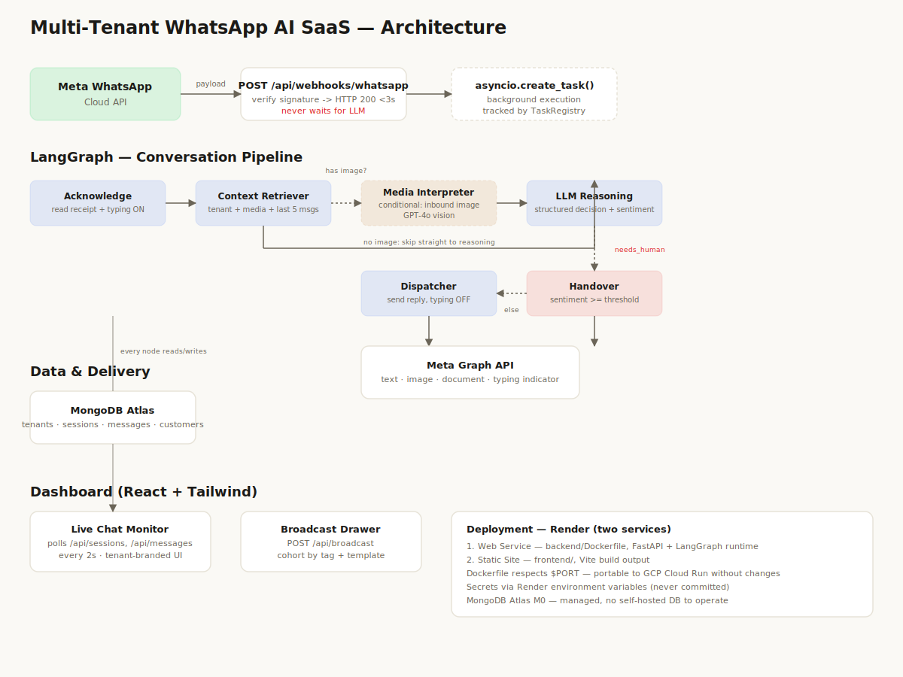

# Multi-Tenant WhatsApp AI SaaS

A production-shaped, multi-tenant WhatsApp Support & Sales agent. Built with **FastAPI + LangGraph + OpenAI** on the backend and a **React + Tailwind** monitoring dashboard on the frontend, backed by **MongoDB Atlas**.



## Table of contents
- [Quick start](#quick-start)
- [Environment variables](#environment-variables)
- [Running locally](#running-locally)
- [LangGraph architecture](#langgraph-architecture)
- [Project structure](#project-structure)
- [Deployment (Render)](#deployment-render)
- [Bonus features implemented](#bonus-features-implemented)

## Quick start

1. Clone the repo and `cd` into it.
2. Copy env templates and fill them in (see [Environment variables](#environment-variables)):
   ```bash
   cp backend/.env.example backend/.env
   cp frontend/.env.example frontend/.env
   ```
3. Seed the two demo tenants (Luxury Furniture Co. and Automotive Care Center):
   ```bash
   cd backend
   pip install -r requirements.txt
   python -m scripts.seed_db
   ```
4. Run locally with Docker Compose, or manually — see [Running locally](#running-locally).
5. Point your Meta App's webhook at `https://<your-backend-url>/api/webhooks/whatsapp`.

## Environment variables

All backend config lives in `backend/.env` (see `backend/.env.example` for the full annotated list, including exactly where in the Meta/Atlas/OpenAI dashboards to find each value). Key ones:

| Variable | Purpose |
|---|---|
| `MONGODB_URI` | Atlas connection string (M0 free tier is enough) |
| `OPENAI_API_KEY` | Used for both reasoning (`OPENAI_MODEL`) and vision (`OPENAI_VISION_MODEL`) |
| `META_APP_SECRET` | Verifies `X-Hub-Signature-256` on inbound webhooks |
| `META_WEBHOOK_VERIFY_TOKEN` | Used in Meta's GET webhook verification handshake |
| `META_ACCESS_TOKEN` / `META_PHONE_NUMBER_ID` | Auth for outbound Graph API calls |
| `HANDOVER_SENTIMENT_THRESHOLD` | 0.0–1.0; sentiment score above this triggers human handover |

Frontend needs one variable, in `frontend/.env`:

| Variable | Purpose |
|---|---|
| `VITE_API_BASE_URL` | Base URL of the backend API |

## Running locally

**Option A — Docker Compose (recommended):**
```bash
docker compose up --build
```
Backend on `http://localhost:8000`, frontend on `http://localhost:5173`.

**Option B — manual:**
```bash
# Backend
cd backend
pip install -r requirements.txt
uvicorn app.main:app --reload

# Frontend (separate terminal)
cd frontend
npm install
npm run dev
```

**Running tests:**
```bash
cd backend
pip install -r requirements-dev.txt
pytest -v
```
20 tests covering graph node logic, tenant-isolated repository queries, WhatsApp client retry policy, and the webhook's async-response guarantee.

## LangGraph architecture

### State (`app/graph/state.py`)
A single `ConversationState` TypedDict flows through every node. Each node reads/writes a well-typed slice of it — no ad-hoc dict mutation. `IncomingMessage` and `ReplyDecision` are proper Pydantic models within the state, so the LLM's structured output is validated at the boundary, not trusted blindly.

### Nodes and edges
```
Acknowledge → Context Retriever → (conditional: inbound image?)
                                        ├─ yes → Media Interpreter → LLM Reasoning
                                        └─ no  ───────────────────→ LLM Reasoning
LLM Reasoning → (conditional: needs_human?)
                     ├─ yes → Handover  → END
                     └─ no  → Dispatcher → END
```

- **Acknowledge** — saves the inbound message (`status=PENDING_RESPONSE`), sends the read receipt, flips `session.status` to `AGENT_RESPONDING` (this is what the dashboard's typing indicator polls for), and starts a **typing heartbeat** — WhatsApp's typing indicator expires after ~25s, so a background loop re-sends it every 20s until the reply is dispatched.
- **Context Retriever** — loads the tenant's system prompt, media library, and last 5 messages.
- **Media Interpreter** *(bonus, conditional)* — only runs for inbound images; uses GPT-4o vision to describe the image, folded into the LLM's context.
- **LLM Reasoning** — the agentic core. Uses OpenAI structured outputs (strict JSON schema) to decide `reply_type` (text/image/document), which media key to use, a `sentiment_score`, and `needs_human`. The sentiment threshold is also enforced in code as a backstop, not solely trusted from the model.
- **Handover** *(bonus)* — terminal node for escalation. Sends a **fixed** message (never LLM-generated, deliberately — you don't want a model improvising mid-escalation), sets `session.status = NEEDS_HUMAN`, which the dashboard highlights in red.
- **Dispatcher** — sends the decided reply via the correct Meta API call, records it, stops the typing heartbeat, resets session status to `WAITING_FOR_BOT`.

### Why this shape
Every node factory closes over a `GraphDependencies` dataclass (repositories + services) rather than reaching for global singletons — keeps nodes testable in isolation (see `tests/unit/test_graph_nodes.py`, all mocked, no real DB/Meta/OpenAI calls). The graph is **compiled once at startup** (`app.state.compiled_graph`) and reused for every conversation turn.

## Project structure

```
whatsapp-ai-saas/
├── backend/
│   └── app/
│       ├── api/routers/        # webhook, tenants, sessions, messages, broadcast
│       ├── services/           # WhatsApp client, LLM, vision, typing heartbeat
│       ├── database/repositories/  # tenant-scoped data access
│       ├── models/ + schemas/  # Mongo document shapes vs. API contracts (kept separate)
│       ├── graph/               # LangGraph state, nodes, builder
│       ├── utils/               # logging, signature verification, task registry
│       └── config/settings.py   # single source of truth for env vars
├── frontend/
│   └── src/
│       ├── components/layout/   # Sidebar, TenantSwitcher
│       ├── components/chat/     # ChatList, ConversationWindow, MediaPreview, TypingIndicator
│       ├── components/broadcast/# BroadcastDrawer
│       └── hooks/ + api/ + store/
└── docs/architecture-diagram.svg
```

## Deployment (Render)

Deployed as **two separate Render services** from this one repo:

1. **Backend — Web Service**
   - Root directory: `backend/`
   - Environment: Docker (uses `backend/Dockerfile`)
   - Add all variables from `backend/.env.example` in Render's Environment tab (never commit `.env`)
   - Render injects `$PORT` automatically — the Dockerfile already respects it, so no changes needed
2. **Frontend — Static Site**
   - Root directory: `frontend/`
   - Build command: `npm install && npm run build`
   - Publish directory: `dist`
   - Set `VITE_API_BASE_URL` to the backend service's Render URL

After both are live, set the backend's URL + `/api/webhooks/whatsapp` as the webhook URL in your Meta App dashboard, using the same value you set for `META_WEBHOOK_VERIFY_TOKEN`.

**Portability note:** the Dockerfile uses shell-form `CMD` with `${PORT}` expansion and no Render-specific assumptions — it runs unmodified on GCP Cloud Run if you prefer that instead.

## Bonus features implemented

- ✅ **Webhook signature validation** — `X-Hub-Signature-256` verified via constant-time HMAC comparison (`app/utils/signature_verification.py`) before any payload processing.
- ✅ **Inbound media parsing** — GPT-4o vision describes customer-sent images (`app/services/vision_service.py`), folded into the LLM's reasoning context.
- ✅ **Fallback handover** — sentiment-scored on every turn; crossing `HANDOVER_SENTIMENT_THRESHOLD` routes to a dedicated `Handover` node, flips session status to `NEEDS_HUMAN`, and the dashboard highlights that conversation in red.
